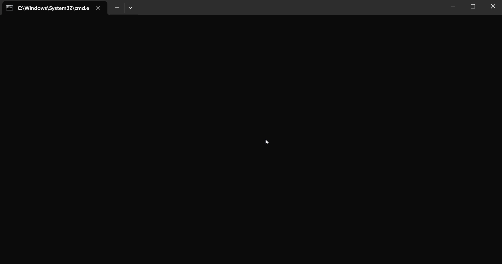

# The Game of Life

## Setup
1. Install `xmake` from [https://xmake.io/](https://xmake.io/)
2. Open the project folder
3. Execute command `xmake` to build the project
4. You will find the executable `life` in folder `bin`

### Note
- Theoretically this applies to any mainstream platform since my codes are all platform-independent, but I only tested it under Windows.
- If you encounter any issue, please report them on the `issue` page of this repository.

## Test
1. Launch the executable
2. Set the window resolution*, grid resolution* and animation speed*.
3. Set the initial configuration by clicking.
4. Press `enter` to start the game.
5. Press `backspace` to reset.

## Example

